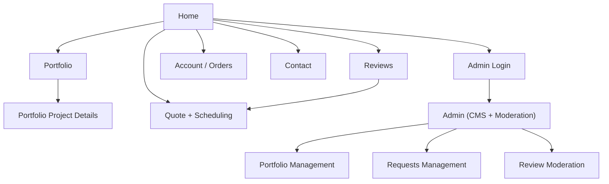

## 1. Product Overview

A mobile-first PWA marketing + lead-capture site for a local TV/picture mounting business.
It showcases past work, collects verified reviews, and lets customers request quotes and schedule installs.

## 2. Core Features

### 2.1 User Roles

| Role                         | Registration Method              | Core Permissions                                                                                                      |
| ---------------------------- | -------------------------------- | --------------------------------------------------------------------------------------------------------------------- |
| Visitor                      | No registration                  | Browse portfolio, read reviews, request quote/schedule, submit contact request                                        |
| Customer (Verified)          | Email OTP / magic link           | Everything a visitor can do, plus create orders, leave verified reviews, and contact support after a job is completed |
| Admin (Business Owner/Staff) | Email + password (Supabase Auth) | Manage site content (CMS), manage portfolio, moderate reviews, manage quote/scheduling requests, respond to inquiries |

### 2.2 Feature Module

Our site requirements consist of the following main pages:

1. **Home**: services overview, trust signals, CTA to quote/schedule, featured portfolio + reviews.
2. **Portfolio**: gallery filtering, before/after highlights, navigation to project details.
3. **Portfolio Project Details**: project description, images, scope notes, location (approx), related projects.
4. **Reviews**: verified review list, rating summary, “leave a review” entry (verification-based), reporting.
5. **Quote + Scheduling**: guided intake form, availability preference capture, file/photo upload, confirmation.
6. **Account + Orders**: customer sign-in, create an order, view order status, leave a review for completed orders, send post-completion support requests.
6. **Contact**: contact form + business info, service area, emergency/after-hours note.
7. **Admin (CMS + Moderation)**: login, manage pages content, manage portfolio, manage requests, review moderation.

### 2.3 Page Details

| Page Name                 | Module Name              | Feature description                                                                    |
| ------------------------- | ------------------------ | -------------------------------------------------------------------------------------- |
| Home                      | Hero + Primary CTA       | Drive to “Request Quote / Schedule” with clear value props and service area            |
| Home                      | Services                 | Explain core offerings (TV mounting, picture/art hanging, cable concealment)           |
| Home                      | Social proof             | Show featured verified reviews and badges (licensed/insured if applicable)             |
| Home                      | Featured work            | Display a small gallery linking to Portfolio and Project Details                       |
| Portfolio                 | Gallery + Filters        | Browse projects by category (TV / art / cable concealment) and room type               |
| Portfolio                 | Project cards            | Show thumbnail, title, short summary, “View details”                                   |
| Portfolio Project Details | Media + Description      | Present image carousel, problem/solution summary, and key constraints                  |
| Portfolio Project Details | Inquiry CTA              | Start quote with project prefill (category)                                            |
| Reviews                   | Review list              | Show verified reviews first with rating, date, and masked customer name                |
| Reviews                   | Moderation states        | Hide or label reviews based on status (pending/approved/rejected)                      |
| Reviews                   | Submit review (verified) | Allow review submission using a verification link/code tied to a completed job         |
| Quote + Scheduling        | Guided intake            | Collect job type, TV size, wall type, add-ons, address, preferred dates/times          |
| Quote + Scheduling        | Quote output             | Display estimated price range and next-step messaging (final quote after confirmation) |
| Quote + Scheduling        | Uploads                  | Attach photos (wall, TV area, wires) for accurate quoting                              |
| Quote + Scheduling        | Confirmation             | Create request record, show confirmation screen, send email notification               |
| Account + Orders          | Customer auth            | Email OTP sign-in, profile basics (name, phone), session management                    |
| Account + Orders          | Create order             | Create an order request (same inputs as quote) tied to signed-in customer              |
| Account + Orders          | Order status             | View order timeline/status updates, appointment details, and completion confirmation   |
| Account + Orders          | Post-completion support  | Open a support request tied to a completed order for issues/complaints/questions       |
| Account + Orders          | Tips                     | Show tip options (Cash App deep link/QR and cash note) and optionally record intent    |
| Contact                   | Contact form             | Capture name, phone/email, message, preferred contact method                           |
| Contact                   | Business details         | Show phone, hours, service area, and policy notes                                      |
| Admin (CMS + Moderation)  | Auth                     | Admin login/logout and session management                                              |
| Admin (CMS + Moderation)  | CMS content              | Edit homepage sections, services text, service area, business info                     |
| Admin (CMS + Moderation)  | Portfolio management     | Create/edit projects, upload images, set categories and featured flag                  |
| Admin (CMS + Moderation)  | Requests management      | View/update quote & scheduling requests and their statuses                             |
| Admin (CMS + Moderation)  | Review moderation        | Approve/reject/edit for clarity, mark verified, and remove abusive content             |

## 3. Core Process

**Visitor Flow**: You land on Home → browse services and trust signals → view Portfolio → open a Project Details page → request Quote + Scheduling (optionally upload photos) → receive confirmation and wait for admin follow-up.

**Verified Review Flow**: After a completed job, you receive a review link/code → open Reviews (or a dedicated review entry state) → submit rating + text → review becomes “pending” until admin approves → approved reviews appear publicly as “verified”.

**Customer Order Flow (Signed-in)**: You sign in via email OTP → create an order (job details + preferred time + photos) → receive confirmation and status updates → after completion, you can (a) leave a verified review and (b) open a support request for any issues.

**Tips Flow**: After completion, the order details screen shows a “Tip” panel with a Cash App link/QR and a note for cash tips; if desired, the customer can optionally record a tip intent (amount + method) for the owners’ tracking.

**Admin Flow**: You log into Admin → review new quote/scheduling requests → update status (new/in progress/confirmed/completed) → optionally send a review link/code after completion → moderate incoming reviews → update portfolio and site content as needed.

## 4. Payments & Tips (Constraints)

- Payments are collected offline: **Cash** or **Cash App**.
- The site must not claim to process card payments.
- The site may show a Cash App handle, a deep link, and a QR code for tips and payment convenience.
