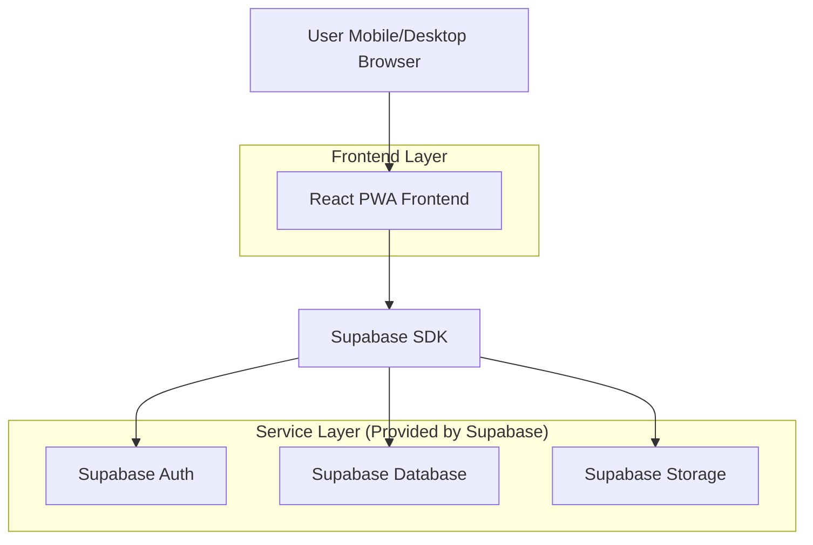
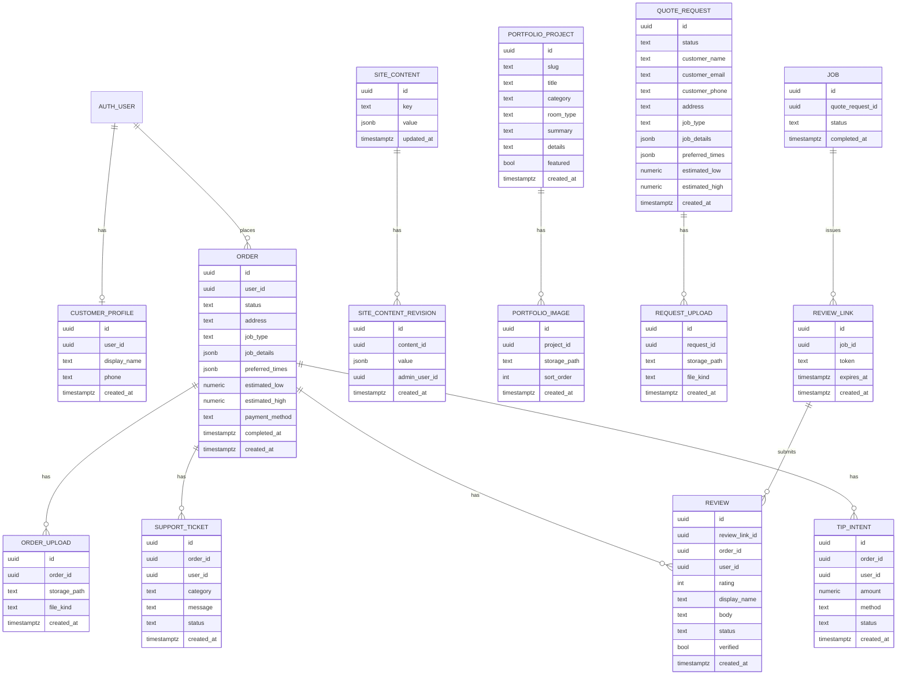

## 1.Architecture design


## 2.Technology Description
- Frontend: React@18 + vite + TypeScript + tailwindcss@3 + PWA service worker (Workbox)
- Backend: Supabase (Auth + Postgres + Storage)

## 3.Route definitions
| Route | Purpose |
|-------|---------|
| / | Home page (services, CTAs, featured work, featured reviews) |
| /portfolio | Portfolio gallery + filters |
| /portfolio/:slug | Portfolio project details |
| /reviews | Verified reviews list + verified submission entry |
| /quote | Quote + scheduling intake flow |
| /contact | Contact form + business details |
| /account | Customer sign-in/profile entry point |
| /orders | Customer orders list |
| /orders/:id | Customer order details (status, review, support, tip) |
| /admin/login | Admin authentication |
| /admin | Admin console (CMS + requests + moderation) |

## 6.Data model(if applicable)

### 6.1 Data model definition


### 6.2 Data Definition Language
Site content (site_content)
```
CREATE TABLE site_content (
  id UUID PRIMARY KEY DEFAULT gen_random_uuid(),
  key TEXT UNIQUE NOT NULL,
  value JSONB NOT NULL DEFAULT '{}'::jsonb,
  updated_at TIMESTAMPTZ NOT NULL DEFAULT now()
);

GRANT SELECT ON site_content TO anon;
GRANT ALL PRIVILEGES ON site_content TO authenticated;
```

Portfolio (portfolio_projects, portfolio_images)
```
CREATE TABLE portfolio_projects (
  id UUID PRIMARY KEY DEFAULT gen_random_uuid(),
  slug TEXT UNIQUE NOT NULL,
  title TEXT NOT NULL,
  category TEXT NOT NULL,
  room_type TEXT,
  summary TEXT,
  details TEXT,
  featured BOOLEAN NOT NULL DEFAULT false,
  created_at TIMESTAMPTZ NOT NULL DEFAULT now()
);

CREATE TABLE portfolio_images (
  id UUID PRIMARY KEY DEFAULT gen_random_uuid(),
  project_id UUID NOT NULL,
  storage_path TEXT NOT NULL,
  sort_order INT NOT NULL DEFAULT 0,
  created_at TIMESTAMPTZ NOT NULL DEFAULT now()
);

GRANT SELECT ON portfolio_projects TO anon;
GRANT SELECT ON portfolio_images TO anon;
GRANT ALL PRIVILEGES ON portfolio_projects TO authenticated;
GRANT ALL PRIVILEGES ON portfolio_images TO authenticated;
```

Leads (quote_requests, request_uploads, contact_messages)
```
CREATE TABLE quote_requests (
  id UUID PRIMARY KEY DEFAULT gen_random_uuid(),
  status TEXT NOT NULL DEFAULT 'new',
  customer_name TEXT NOT NULL,
  customer_email TEXT,
  customer_phone TEXT,
  address TEXT,
  job_type TEXT NOT NULL,
  job_details JSONB NOT NULL DEFAULT '{}'::jsonb,
  preferred_times JSONB NOT NULL DEFAULT '[]'::jsonb,
  estimated_low NUMERIC,
  estimated_high NUMERIC,
  created_at TIMESTAMPTZ NOT NULL DEFAULT now()
);

CREATE TABLE request_uploads (
  id UUID PRIMARY KEY DEFAULT gen_random_uuid(),
  request_id UUID NOT NULL,
  storage_path TEXT NOT NULL,
  file_kind TEXT NOT NULL,
  created_at TIMESTAMPTZ NOT NULL DEFAULT now()
);

CREATE TABLE contact_messages (
  id UUID PRIMARY KEY DEFAULT gen_random_uuid(),
  name TEXT NOT NULL,
  email TEXT,
  phone TEXT,
  message TEXT NOT NULL,
  preferred_contact TEXT,
  created_at TIMESTAMPTZ NOT NULL DEFAULT now()
);

-- Public should not read leads; only create.
GRANT INSERT ON quote_requests TO anon;
GRANT INSERT ON request_uploads TO anon;
GRANT INSERT ON contact_messages TO anon;
GRANT ALL PRIVILEGES ON quote_requests TO authenticated;
GRANT ALL PRIVILEGES ON request_uploads TO authenticated;
GRANT ALL PRIVILEGES ON contact_messages TO authenticated;
```

Reviews (jobs, review_links, reviews)
```
CREATE TABLE jobs (
  id UUID PRIMARY KEY DEFAULT gen_random_uuid(),
  quote_request_id UUID,
  status TEXT NOT NULL DEFAULT 'completed',
  completed_at TIMESTAMPTZ
);

CREATE TABLE review_links (
  id UUID PRIMARY KEY DEFAULT gen_random_uuid(),
  job_id UUID NOT NULL,
  token TEXT UNIQUE NOT NULL,
  expires_at TIMESTAMPTZ,
  created_at TIMESTAMPTZ NOT NULL DEFAULT now()
);

CREATE TABLE reviews (
  id UUID PRIMARY KEY DEFAULT gen_random_uuid(),
  review_link_id UUID NOT NULL,
  order_id UUID,
  user_id UUID,
  rating INT NOT NULL,
  display_name TEXT NOT NULL,
  body TEXT NOT NULL,
  status TEXT NOT NULL DEFAULT 'pending',
  verified BOOLEAN NOT NULL DEFAULT true,
  created_at TIMESTAMPTZ NOT NULL DEFAULT now()
);

GRANT SELECT ON reviews TO anon;
GRANT ALL PRIVILEGES ON jobs TO authenticated;
GRANT ALL PRIVILEGES ON review_links TO authenticated;
GRANT ALL PRIVILEGES ON reviews TO authenticated;
```

Notes:
- Use Supabase Storage buckets for portfolio images and request uploads; store object paths in tables.
- Enforce public-vs-admin access primarily via RLS policies (recommended) plus the GRANTs above.
- Customer authentication: use Supabase Auth email OTP/magic link; customers are considered "verified" once their email is confirmed.
- Orders: created by authenticated customers; admins can update status and completion. Reviews and support tickets should be allowed only for completed orders.
- Payments/tips: record selected method and optional tip intent, but collect money offline (cash/Cash App).
- PWA
